# Realm Agent Studio 全面改版产品说明文件

> 用途：这是一份可以直接交给设计 AI、前端 AI、产品 AI 执行全面改版的产品说明文件。它基于当前 Realm Agent Studio App 已有内容、`.nimi/spec/realm-persona-studio/canonical/**` 权威边界、`AGENTS.md` 项目规则，以及 `realm-agent-studio-three-layer-structure-report.zh.md` 的三层结构报告。

## 0. 一句话定位

Realm Agent Studio 是 Owner 面向自己创建的 Public Realm Agent 的工业级创建与运营桌面控制台。它不是聊天客户端，不是系统 Agent 管理后台，不是 LocalAgent 私有运行时界面，也不是一个轻量表单生成器。

目标体验应是：用户从一个面向未来的 3D Agent Hub 进入，在空间层理解 Agent、World、DNA、Creation Graph 与运营状态；在停靠工作台中完成复杂字段编辑；在 Review Gate 中确认每一次真实写入 Realm 的 payload、来源、风险和边界。

## 1. 不可妥协边界

### 1.1 项目状态

- App name: `Realm Agent Studio`
- Canonical app_id: `nimi.realm-agent-studio`
- Tauri identifier: `nimi.realm-agent-studio`
- 当前状态：Pre-Alpha，未上线。
- 没有 legacy 负担，可以硬切信息架构、视觉系统和页面结构。
- 不允许以 MVP 方式降低复杂性；目标是面向未来的工业级产品。

### 1.2 产品范围

必须包含：

- Owner-created Realm Agents。
- Agent public profile / settings。
- Visual identity candidates。
- Agent-authored post candidates。
- 单个本地 schedule candidate。
- 来源明确的 `friendCount`。
- 三种当前可用创建方式：描述生成、Downloaded CharacterCard 导入、手动高级创建。

必须排除：

- LocalAgent 私有 runtime / memory / emotion state。
- Creator / world-created agent 管理。
- Forge-imported system curation。
- Studio 内 agent direct chat。
- Version history / rollback diffs。
- Performance analytics。
- Gift / economic settlement。
- Team collaboration。

### 1.3 数据与失败原则

- Fail closed：缺字段、缺能力、缺来源、缺权限时，必须显示明确不可用或阻塞状态。
- 不允许 fake data、pseudo success、placeholder truth。
- 不允许零填指标。`friendCount` 缺失时必须展示 `source unavailable`，不能显示 `0`。
- AI 生成结果永远是 candidate，必须经过 owner review 才能进入写入计划。
- Realm publish success 只能在 `PostsService.createPost` 返回 canonical post object 后成立。
- 本地 schedule 只是 app-local、foreground-only、single-candidate，不是 Realm campaign / queue / recurrence。
- Studio 不持有 access token / refresh token。认证状态必须经过 Runtime account IPC bridge。

## 2. 当前 App 已有结构

### 2.1 技术结构

- Desktop shell: Tauri 2，`src-tauri/`
- Renderer: React 19 + Vite 7 + Tailwind 4，`src/shell/renderer/`
- Routing: `react-router-dom`，`src/shell/renderer/app-shell/routes.tsx`
- UI: `@nimiplatform/kit`
- Platform client: `@nimiplatform/sdk`
- State: Zustand
- Dev port: `1450`

### 2.2 当前路由

- `/portfolio`：Owner portfolio list。
- `/portfolio/create`：Realm Agent 创建工作区。
- `/portfolio/:agentId`：Agent detail / cockpit。
- `/portfolio/:agentId/settings`：Owner settings。
- `/portfolio/:agentId/settings/review`：Settings review。
- `/portfolio/:agentId/assets`：Identity / media / voice candidates。
- `/portfolio/:agentId/posts`：Post studio。
- `/portfolio/:agentId/posts/schedule`：Local schedule。
- `/portfolio/:agentId/insights`：当前应保持 source-backed light insight，不能扩展成 analytics。
- `/ai-config`：Studio AI 配置。

### 2.3 当前 owner portfolio 字段

Portfolio list / detail 当前只应来自 owner-scoped Realm MeService：

- list source: `Realm MeService.listMyRealmAgents`
- detail source: `Realm MeService.getMyRealmAgent`
- fields:
  - `id`
  - `displayName`
  - `handle`
  - `coverUrl`
  - `avatarUrl`
  - `ownerScope: owner-created`
  - `realmState`
  - `worldName`
  - `updatedAt`
  - `friendCount`

`friendCount` 必须是：

- `{ status: 'available', value: number }`
- 或 `{ status: 'source-unavailable', label: 'friendCount source unavailable' }`

### 2.4 当前创建 draft 字段

创建 draft 当前包含：

- `handle`
- `displayName`
- `concept`
- `description`
- `ruleText`
- `selectedWorldId`
- `dnaPrimary`
- `dnaSecondary`
- `referenceImageUrl`
- `originalDescription`

创建 readiness 当前要求：

- `handle` 非空。
- `displayName` 非空。
- `concept` 非空。
- `selectedWorldId` 非空，并且来自 source-backed selectable worlds。
- `dnaPrimary` 非空。
- handle availability 已通过 `AgentsService.agentControllerCheckHandle` 检查。
- Agent Creation Graph 已通过 owner acceptance，并且 fingerprint 未过期。

Realm create payload 当前写入：

- `handle`
- `displayName`
- `worldId`
- `concept`
- `ownershipType: MASTER_OWNED`
- `dna`
- `dnaPrimary`
- optional `dnaSecondary`
- optional `description`
- optional `rules`
- optional `referenceImageUrl`

## 3. 三种当前创建方式

本次全面改版必须同时支持三种创建方式。它们不是三个独立表单，而是三个 Source Input 入口，进入同一套 Creation Graph、World、DNA、Owner Review 和 Realm Create 管线。

### 3.1 方式 A：描述生成

当前 source mode：`description`

用户输入：

- 一段自然语言描述。

当前系统行为：

- 调用 `generateAgentSeedFromDescription(seedDescription)`。
- 生成候选字段：
  - `handle`
  - `displayName`
  - `concept`
  - `description`
  - `ruleText`
  - `dnaPrimary`
  - `dnaSecondary`
  - `originalDescription`
- 生成 reference image prompt seed。
- 进入 edit stage。

目标设计：

- 不展示为“普通文本框 + 下一步”的弱体验。
- 应展示为 Source Input Reactor：
  - 中心是一个高密度 prompt console。
  - 右侧实时展示 seed extraction preview。
  - 底部展示 runtime rationale、blocked fields、missing decisions。
  - 生成后进入同一张 Creation Graph，不直接进入创建成功。

AI 改版要求：

- 描述生成只能产出候选。
- 生成结果必须标注为 AI-seeded candidate。
- 用户修改任一关键字段后，Creation Graph fingerprint 必须变 stale，需要重新 accept。
- 不能把 AI rationale 当成真实来源。

### 3.2 方式 B：Downloaded CharacterCard 导入

当前 source mode：`downloaded-character-card`

用户输入：

- 本地 `.json`
- 本地 `.png`
- accept: `.json,.png,application/json,image/png`

当前解析边界：

- 最大 2MB。
- JSON 直接读取。
- PNG 从 metadata 中读取 `chara` text chunk。
- 本地解析，不应默认上传。

当前失败类型：

- `character-card-empty`
- `character-card-oversized`
- `character-card-unsupported-file`
- `character-card-json-parse-failed`
- `character-card-json-shape-invalid`
- `character-card-png-invalid`
- `character-card-png-metadata-missing`
- `character-card-png-metadata-invalid`

当前可读字段：

- `name`
- `description`
- `personality`
- `scenario`
- `first_mes`
- `mes_example`
- `creator_notes`
- `system_prompt`
- `post_history_instructions`
- `alternate_greetings`
- `tags`
- `creator`
- `character_version`
- `extensions`
- `character_book`
- unknown data keys

当前映射：

- `name` -> `displayName` / handle seed。
- `description + personality + scenario` -> `concept` / `description`。
- `personality + scenario + system_prompt + post_history_instructions + creator_notes` -> `ruleText` candidate。
- heuristic classifier -> `dnaPrimary` / `dnaSecondary`。
- `originalDescription` -> `CharacterCard import: {name}`。

Creation Graph source field status：

- mapped：可进入 create/settings 的字段。
- candidateOnly：只能作为候选，不直接写入。
- unmapped：保留来源证据，不写入。
- rejected：明确拒绝。

目标设计：

- CharacterCard 不是“上传文件表单”，而是 Import Disassembly Chamber。
- 用户导入后，应看到三栏：
  - Source Payload：原始字段、未知字段、spec、spec version、source name、format。
  - Mapping Graph：每个字段如何进入 identity / dna / worldview / behavior / greeting / voice / post brief。
  - Risk Ledger：system_prompt、post_history_instructions、character_book、extensions、unknown keys 等不能直接写入的原因。
- 对每个字段必须显示 mapped / candidateOnly / unmapped / rejected。
- 用户必须能看见哪些字段进入 Realm Create，哪些只是后续 Settings / Assets / Posts candidate。

AI 改版要求：

- 不得把 CharacterCard 当成 Realm truth。
- 不得隐藏 unmapped / unknown fields。
- 不得自动把 system prompt 当 public rules 写入。
- 不得因为 import 成功就创建 Agent。
- PNG metadata missing 必须是明确失败，不允许 fallback 成空卡片。

### 3.3 方式 C：手动高级创建

当前 source mode：`manual`

用户输入：

- 用户跳过 seed，直接进入编辑工作台。
- 可手动填写所有 create draft 字段。

目标设计：

- Manual 不应是低级备用表单，而是 Advanced Graph Authoring。
- 用户可以直接操控：
  - Identity
  - Worldview
  - DNA
  - behavior boundaries
  - visible profile description
  - reference image URL / reference prompt
- 所有字段仍然进入同一 Creation Graph。
- 所有 write plan 仍然需要 Review Gate acceptance。

AI 改版要求：

- Manual 也必须有 source provenance。
- Manual 也必须有 missing decisions ledger。
- Manual 不绕过 handle availability、world source、DNA primary、Creation Graph review。
- Manual 不允许直接写 raw forbidden fields。

### 3.4 当前预留但不可作为主创建方式：Existing Agent Remix

当前 source mode：`existing-agent-remix`

当前状态：

- 类型层存在。
- UI 层显示 deferred warning。
- 不应作为本次三种创建方式之一。

目标设计：

- 可以在界面中保留为 locked / deferred future capability。
- 不得展示为可用入口。
- 不得接入 Forge-imported system、creator/world agent 或 dev-agent surface。

## 4. 三层结构：目标体验架构

全面改版必须采用三层结构：Spatial Overview、Docked Workbench、Review Gate。

### 4.1 第一层：Spatial Overview

用途：

- 展示 Agent / World / DNA / Creation Graph 的空间关系。
- 用于导航、拓扑、状态、进度和转场。
- 用于让用户理解“我正在构造一个可进入 Realm 的生命体/角色/公共 Agent”，而不是填写一份后台表单。

适合展示：

- Agent Hub 的 3D orbit。
- World selection 的 spatial map。
- DNA primary / secondary traits 的 radial lattice。
- Creation Graph section status。
- Source-to-write-plan flow。
- Portfolio agent constellation。

禁止承载：

- 长文本输入。
- 大量设置字段。
- JSON 预览。
- 复杂校验信息。
- 多段规则编辑。

### 4.2 第二层：Docked Workbench

用途：

- 承载所有复杂输入。
- 承载字段编辑、候选检查、source mapping、preview、差异确认。
- 是真正的工业控制台，不是弹窗表单。

布局原则：

- Desktop 推荐 35/65：
  - 左 35%：3D Hub / Graph / World / DNA spatial overview。
  - 右 65%：Docked Workbench。
- Workbench 内使用 tabs / segmented controls / accordions / inspector panels。
- 长字段必须在稳定尺寸容器中编辑，不能悬浮在 3D HUD 上。
- 所有 dense data 以 2D controls 展示。

### 4.3 第三层：Review Gate

用途：

- 真正写入前的确认层。
- 显示 source、candidate、payload、write path、blocked/deferred、风险。
- 建立 owner human review。

必须覆盖：

- Realm Create。
- Owner settings update。
- Avatar URL selection。
- Post publish。
- Local schedule。

Review Gate 不只是确认弹窗，而是一个 persistent bottom/right gate：

- 当前是否 ready。
- 哪些 required sections blocked。
- 哪些 candidate 还没有 owner review。
- Graph fingerprint 是否 stale。
- 即将写入哪个 service/path。
- 哪些字段不会写入。

## 5. 全面改版后的目标信息架构

### 5.1 Shell

主导航建议：

- `Hub`
- `Create`
- `Agents`
- `Assets`
- `Posts`
- `AI Config`

但底层路由可先保留当前路由，视觉 IA 可以硬切：

- `/portfolio` 变成 Hub / Agents constellation。
- `/portfolio/create` 变成 Create Cockpit。
- `/portfolio/:agentId` 变成 Agent Cockpit。
- `/portfolio/:agentId/settings` 变成 Profile & Behavior Workbench。
- `/portfolio/:agentId/assets` 变成 Identity Studio。
- `/portfolio/:agentId/posts` 变成 Content Studio。
- `/portfolio/:agentId/posts/schedule` 变成 Local Schedule Gate。
- `/ai-config` 变成 Capability Matrix。

### 5.2 First-run Hub

当用户没有 Agent 时，Hub 不应空白，也不应伪造数据。

目标：

- Hub 自动切入 First Agent Creation Cockpit。
- 可以展示一个官方 Reference Agent，但必须是 read-only sample / product teaching artifact。
- 官方 Reference Agent 不进入 owner portfolio。
- 官方 Reference Agent 不产生 owner metrics。
- 官方 Reference Agent 不调用 `/api/me/agents` 写入。

First-run Hub 结构：

- 左侧：官方 Reference Agent 的 read-only 3D silhouette / profile card / graph demo。
- 中央：Create Source Input。
- 右侧：What will be created / Review readiness。
- 底部：Creation Graph / Review Gate。

官方 Reference Agent 的用途：

- 让用户看见“创建完成后的 Agent Hub 长什么样”。
- 解释 Agent profile、World、DNA、Identity assets、first post candidate 的关系。
- 引导用户创建自己的 Agent。

官方 Reference Agent 的限制：

- 必须标注 read-only reference。
- 不显示 fake friendCount。
- 不显示 owner state。
- 不出现在真实 owner-created list 中。
- 不允许编辑和发布。

## 6. Create Cockpit 完整流程

目标流程不是多张传统表单，而是一条 source-to-realm creation pipeline。

```mermaid
flowchart LR
  A["Source Input<br/>Description / CharacterCard / Manual"] --> B["Source Package<br/>local evidence + owner intent"]
  B --> C["Creation Graph<br/>identity / dna / worldview / behavior / provenance"]
  C --> D["World<br/>OASIS / selectable source-backed worlds"]
  D --> E["DNA<br/>primary archetype / secondary traits"]
  E --> F["Owner Review<br/>required fields + write plan + graph fingerprint"]
  F --> G["Realm Create<br/>owner-scoped create path"]
  G --> H["Agent Hub<br/>detail / settings / identity / posts"]
```



### 6.1 Source Input

Source Input 是三个方式的共同入口：

- Description Reactor。
- CharacterCard Import Disassembly。
- Manual Graph Authoring。

共同输出：

- `sourceMode`
- `sourceLabel`
- `sourceFields`
- `originalDescription`
- initial draft patch。

### 6.2 Creation Graph

Creation Graph 当前 section keys：

- `identity`
- `dna`
- `behavior`
- `worldview`
- `greeting`
- `communicationVoice`
- `contentVoice`
- `visualBrief`
- `voiceBrief`
- `postBrief`
- `sourceProvenance`
- `missingDecisions`
- `riskNotes`
- `writePlan`

Required create sections：

- `identity`
- `dna`
- `worldview`
- `sourceProvenance`
- `writePlan`

Graph status：

- `ready`
- `needs-decision`
- `blocked`

Field status：

- `mapped`
- `candidateOnly`
- `unmapped`
- `rejected`

Write plan targets：

- `realm-create`
- `owner-settings`
- `asset-candidate`
- `post-candidate`
- `blocked`
- `deferred`

目标 UI：

- Graph 不应只是 JSON debug panel。
- 应展示为可审查的 section board：
  - section title。
  - status。
  - source fields。
  - missing fields。
  - risk notes。
  - target write path。
  - rule IDs。
- 用户修改任一 create-critical 字段后，Graph acceptance 失效。

### 6.3 World

当前 world 来源：

- `WorldsService.worldControllerListWorlds`
- selected preview: `WorldsService.worldControllerGetWorldDetailWithAgents`

目标 UI：

- World 是 3D spatial map 中的 destination，不是普通 select。
- 但详细字段仍在 Docked Workbench 中展示。
- OASIS 可作为默认倾向，但必须来自 source-backed worlds。

World preview 字段：

- `id`
- `name`
- `type`
- `status`
- `contentRating`
- `tagline`
- `description`
- `overview`
- `themes`
- `agentCount`
- `nativeCreationState`
- `source`

规则：

- 没有 source-backed world 时，创建阻塞。
- selected world 不在 source-backed list 中时，创建阻塞。

### 6.4 DNA

当前 create 必需：

- `dnaPrimary`

当前可选：

- `dnaSecondary`

当前 reviewed create DNA payload 包含：

- `source: realm-agent-studio.reviewed-create-dna.v1`
- `primaryArchetype`
- `secondaryTraits`
- `identity`
- `personality`
- `communication`

目标 UI：

- Primary archetype 用 radial selector 或 DNA core reactor。
- Secondary traits 用 orbiting trait chips。
- 每个 trait 必须有解释，不只是标签。
- 超出推荐数量时显示 warning，不应 silent truncate。

### 6.5 Owner Review

Owner Review 必须合并两个层面：

- Creation Graph review。
- Create readiness review。

Graph review blocks：

- Graph missing。
- Required sections missing。
- Realm create write plan missing。
- Realm create write plan blocked。
- Identity / DNA / worldview section blocked。
- Graph fingerprint stale。

Create readiness blocks：

- handle missing。
- display name missing。
- concept missing。
- selected world missing。
- DNA primary missing。
- selected world not source-backed。
- handle availability not checked。
- handle unavailable。

### 6.6 Realm Create

Realm Create 只能在以下条件全部满足后发生：

- Creation Graph ready。
- Graph accepted fingerprint equals current graph fingerprint。
- create readiness ready。
- handle availability available。
- selected world source-backed。
- owner explicitly triggers create。

成功后进入：

- Agent Cockpit。
- Settings Workbench。
- Identity Studio。
- Content Studio。

创建成功提示必须区分：

- canonical agent created。
- owner profile settings saved / current / failed。
- partial success。

## 7. Agent Hub / Portfolio 改版说明

### 7.1 有 Agent 时

Hub 是 owner-created public Realm Agents 的空间控制台。

左侧 3D overview：

- 每个 Agent 是一个 node。
- World 是背景轨道或分区。
- `friendCount` available 时可以用真实数值影响 node pulse。
- `friendCount` source-unavailable 时显示断开的 telemetry，不显示 0。

右侧 Workbench：

- Agent list。
- Filter / sort：
  - all。
  - friend-count-available。
  - friend-count-unavailable。
  - realm-order。
  - display-name-asc。
  - updated-desc。
  - friend-count-desc。
  - friend-count-asc。
- 当前 selected agent summary。
- 快速进入：
  - Cockpit。
  - Settings。
  - Assets。
  - Posts。

### 7.2 无 Agent 时

Hub 自动切换为 First Agent Creation Cockpit。

不要：

- 显示空表格。
- 显示 fake sample list。
- 显示 0 agents 后让用户自己找 Create。

要：

- 直接进入创造路径。
- 允许查看官方 Reference Agent。
- 明确说明 Reference Agent 不属于用户。

## 8. Agent Cockpit 改版说明

Agent Cockpit 应是单 Agent 的运营中枢。

核心区域：

- 3D Agent identity preview。
- Public profile snapshot。
- World membership。
- Source-backed `friendCount`。
- State / visibility。
- Next recommended actions：
  - Complete settings。
  - Generate identity pack candidate。
  - Draft first post。
  - Schedule local post candidate。

不能出现：

- LocalAgent memory。
- emotion state。
- private runtime internals。
- fake performance analytics。

## 9. Settings Workbench 改版说明

当前 settings draft 字段：

- `displayName`
- `description`
- `greeting`
- `naturalLanguageIntent`
- `publicRole`
- `worldview`
- `personalitySummary`
- `relationshipMode`
- `interestsText`
- `goalsText`
- `contentStyle`
- `formality`
- `responseLength`
- `sentiment`
- `allowedThemesText`
- `disallowedThemesText`
- `targetAudience`
- `positioning`
- `rawRuleTextCandidate`

Forbidden settings fields：

- `handle`
- `worldId`
- `avatarUrl`
- `profileCoverUrl`
- `provider`
- `model`
- `localAgent`
- `lifecycle`
- `state`
- `dna`
- `agentRule`
- `agentRules`
- `ruleText`

目标设计：

- Settings Workbench 应分为：
  - Public Identity。
  - Behavior & Personality。
  - Communication。
  - Boundaries。
  - Positioning。
  - Raw Rule Review Deferred。
- Runtime settings proposal 只能是 candidate。
- Owner settings update 必须通过 Review Gate。
- 禁止字段必须进入 Blocked Ledger，不允许静默丢弃。

## 10. Identity Studio / Assets 改版说明

当前 asset candidate 类型：

- identity pack candidates:
  - `avatar`
  - `profile-cover`
  - `portrait-reference`
  - `post-image-style`
  - `voice-demo`

当前 resource types：

- `IMAGE`
- `VIDEO`
- `AUDIO`

当前 binding points：

- `AGENT_AVATAR`
- `AGENT_PORTRAIT`
- `AGENT_CANDIDATE`
- `AGENT_VOICE_SAMPLE`

当前 avatar targets：

- `SPRITE2D`
- `LIVE2D`
- `VRM`

当前 public write 边界：

- avatar URL selection：owner URL review 后 admitted。
- profile cover publication：blocked。
- resource-agent binding：blocked。
- voice publication：blocked。
- post attachment：candidate only。

目标设计：

- Identity Studio 是 candidate foundry。
- 左侧展示 identity asset matrix。
- 中间展示 visual / avatar / voice generation workbench。
- 右侧展示 public write ledger。
- 每个 candidate 必须显示是否可写入 public Realm、是否 blocked、blocked reason。

## 11. Content Studio / Posts / Schedule 改版说明

当前 post draft 输入：

- `caption`
- `tagsText`
- `humanReviewed`
- `attachmentEnabled`
- `attachmentTargetType`
- `attachmentTargetId`

Attachment target type：

- `RESOURCE`
- `ASSET`
- `BUNDLE`

Runtime post copy proposal：

- candidate only。
- truthWrite false。

Forbidden post keys：

- `worldId`
- `id`
- `authorId`
- `scheduledAt`
- `scheduleId`
- `queue`
- `campaign`
- `recurrence`
- `publicSuccess`
- `publishSuccess`
- `moderationSuccess`
- `provider`
- `modelResolved`
- `localAgent`
- `LocalAgent`

Local schedule candidate：

- `localDate`
- `localTime`
- `localRunAt`
- `appLocalOnly: true`
- `foreground-when-due`
- `pending-owner-app-open`

目标设计：

- Posts 是 publish gate，不是自由内容编辑器。
- 每条 post 必须从 candidate 进入 human reviewed。
- Schedule 只是本地提醒/执行候选，不是 Realm queue。
- Schedule UI 必须明确：
  - app-local。
  - single candidate。
  - foreground required。
  - not campaign。
  - not recurrence。

## 12. AI Config 改版说明

AI Config 是能力矩阵，不是技术设置页。

它应解释：

- 哪些 Studio surfaces 使用 Runtime text generate。
- 哪些使用 image generate。
- 哪些使用 speech synthesize。
- 当前 active model 是否存在于 Runtime local assets。
- route unavailable / unbound / failed / invalid output 的具体失败。

但不能：

- 在 create/settings/post payload 中泄露 provider/model 字段。
- 把 AI capability 成功当成 Realm write success。
- 绕过 owner review。

## 13. 视觉系统方向

### 13.1 总体风格

建议采用：

- Apple Vision Pro 的空间层次。
- Tesla / SpaceX 工业控制台的信息密度。
- 游戏级未来驾驶舱的状态反馈。

但必须避免：

- 玩具化。
- 单纯炫酷但无法承载复杂字段。
- 大量玻璃卡片堆叠。
- 把复杂表单放在 3D 空间中。
- 只有少量数字的 demo dashboard。

### 13.2 Light Industrial 方向

浅色版本建议：

- 背景：冷白 / 灰白工业材质。
- 主色：graph cyan / signal green / caution amber / danger red。
- 3D 物体：半透明工程材料、细边框、真实阴影。
- Workbench：高密度、低圆角、清晰分区。
- Review Gate：强状态色，但不遮挡输入。

### 13.3 3D Hub 使用规则

3D 用于：

- Agent constellation。
- Source-to-Graph flow。
- World map。
- DNA orbit。
- Status telemetry。
- Successful create transition。

2D 用于：

- 表单。
- 长文本。
- 校验。
- JSON / payload。
- source field mapping。
- review list。
- settings/posts/assets details。

## 14. 关键组件清单

全面改版至少需要以下组件级能力：

- `SourceMethodSwitcher`
  - Description。
  - CharacterCard。
  - Manual。
  - Existing Remix locked/deferred。
- `DescriptionReactor`
  - prompt input。
  - seed extraction preview。
  - runtime rationale。
  - generate state。
- `CharacterCardDisassembly`
  - file picker。
  - parse failure display。
  - raw field table。
  - mapping graph。
  - unknown/unmapped ledger。
- `ManualGraphAuthoring`
  - advanced input sections。
  - graph completeness indicators。
- `CreationGraphBoard`
  - section board。
  - status。
  - missing decisions。
  - risk notes。
  - source field mapping。
- `WorldSelectorMap`
  - 3D world spatial overview。
  - 2D detailed selected world preview。
- `DnaTuner`
  - primary archetype selector。
  - secondary traits selector。
  - trait explanations。
- `HandleAvailabilityGate`
  - loading。
  - available。
  - unavailable。
  - failed。
- `ReferenceImageCandidatePanel`
  - prompt。
  - generated reference URL。
  - clear / regenerate。
  - candidate status。
- `WritePlanLedger`
  - realm-create。
  - owner-settings。
  - asset-candidate。
  - post-candidate。
  - blocked。
  - deferred。
- `ReviewGate`
  - ready / blocked。
  - payload preview。
  - source summary。
  - accept graph。
  - create trigger。
- `BlockedFieldLedger`
  - forbidden field detection。
  - reason。
  - affected surface。
- `SourceUnavailableMetric`
  - especially for `friendCount`。

## 15. 可交给 AI 的页面级改版任务

### 15.1 Create Page

将 `/portfolio/create` 改为 Create Cockpit。

必须包含：

- 左侧 3D Source / Graph / World / DNA spatial overview。
- 右侧 Docked Workbench。
- 底部 Review Gate。
- 三种 source methods。
- CharacterCard field mapping。
- Graph acceptance。
- handle availability gate。
- world source-backed gate。
- DNA required gate。
- create success routing。

### 15.2 Portfolio Page

将 `/portfolio` 改为 Agent Hub。

必须包含：

- 有 Agent：Agent constellation + owner portfolio workbench。
- 无 Agent：First Agent Creation Cockpit + official reference agent。
- 不得伪造 owner data。
- `friendCount` source unavailable 必须可见。

### 15.3 Agent Detail Page

将 `/portfolio/:agentId` 改为 Agent Cockpit。

必须包含：

- public profile。
- world。
- state。
- friendCount。
- action routes。
- boundary copy。

### 15.4 Settings Page

将 settings 改为 Profile & Behavior Workbench。

必须包含：

- settings draft groups。
- runtime proposal candidate。
- forbidden fields ledger。
- owner review gate。

### 15.5 Assets Page

将 assets 改为 Identity Studio。

必须包含：

- identity pack candidates。
- visual generation。
- avatar package。
- voice demo。
- public write ledger。
- blocked publication states。

### 15.6 Posts Page

将 posts 改为 Content Studio。

必须包含：

- copy candidate。
- attachment candidate。
- human review。
- publish gate。
- forbidden post field ledger。

### 15.7 Schedule Page

将 schedule 改为 Local Schedule Gate。

必须包含：

- single local candidate。
- local date/time。
- foreground requirement。
- not Realm queue。
- not campaign。
- not recurrence。

## 16. 验收标准

### 16.1 创建方式覆盖

改版后必须能清楚区分并完整支持：

- 描述生成。
- Downloaded CharacterCard 导入。
- 手动高级创建。

并且必须清楚标注：

- Existing Agent Remix 是 deferred，不是当前可用创建方式。

### 16.2 复杂字段承载

改版后不得出现：

- 3D 图里塞长表单。
- 一张概念图只能展示少数字段，真实字段无处承载。
- 多步骤传统 wizard 导致用户失去全局理解。

必须实现：

- 3D 负责空间理解。
- Workbench 负责复杂输入。
- Review Gate 负责写入确认。

### 16.3 数据真实性

改版后不得出现：

- fake agent。
- fake metric。
- zero-filled friendCount。
- fake create success。
- fake publish success。
- fake model capability。

必须实现：

- source unavailable。
- blocked。
- deferred。
- candidate only。
- owner reviewed。
- canonical success。

### 16.4 权威边界

改版后不得调用或展示为当前产品能力：

- Forge-imported system surfaces。
- creator/world-maintainer surfaces。
- dev-agent surfaces。
- LocalAgent private memory/emotion/runtime。

### 16.5 Human review

以下行为必须有 owner review：

- Creation Graph accept。
- Realm Create。
- Owner settings update。
- avatar URL selection。
- post publish。
- local schedule candidate。

### 16.6 失败体验

失败必须 typed：

- realm unavailable。
- permission missing。
- owner authority missing。
- setting read unavailable。
- runtime route unbound。
- runtime transport unavailable。
- invalid output。
- source unavailable。
- handle unavailable。
- world unavailable。
- CharacterCard parse failure。

## 17. AI 执行提示词

可以将以下提示词交给后续设计/代码 AI：

```text
请基于《Realm Agent Studio 全面改版产品说明文件》重构 Realm Agent Studio 的产品体验。目标不是 MVP，也不是普通表单后台，而是一个面向未来的工业级 Agent creation and operation cockpit。

必须保留当前 Realm Agent Studio 的权威边界：只管理 owner-created public Realm Agents；不接入 LocalAgent private runtime/memory/emotion；不接入 Forge-imported system、creator/world-maintainer 或 dev-agent surfaces；所有 AI 生成内容都是 candidate；所有真实写入必须经过 owner review；friendCount 缺来源时必须显示 source unavailable，不能零填。

Create Cockpit 必须支持三种当前创建方式：描述生成、Downloaded CharacterCard JSON/PNG 本地导入、手动高级创建。existing-agent-remix 只能显示为 deferred future capability，不能作为可用入口。三种入口必须汇入同一套 Source Package -> Creation Graph -> World -> DNA -> Owner Review -> Realm Create -> Agent Hub 管线。

视觉结构必须使用三层模型：Spatial Overview 用于 3D Agent/World/DNA/Graph 状态理解；Docked Workbench 用于复杂字段、长文本、source mapping、settings/posts/assets 编辑；Review Gate 用于写入前确认、payload、blocked/deferred/candidate ledger。不要把复杂表单放进 3D HUD。

请优先改造信息架构、页面布局、组件结构和真实字段承载能力。所有字段、失败状态、source mapping、review gate、blocked ledger 都要在 UI 中可见。不要伪造数据，不要伪造成功，不要使用 placeholder truth。
```

## 18. 第一阶段实施建议

因为项目未上线，可以硬切，但建议按风险从低到高实施：

1. 先改视觉 IA 和文案，把 Create Page 切成三层结构。
2. 再把现有三种 source method 重新包装成 Source Input Cockpit。
3. 把现有 Creation Graph 从 debug/side panel 提升为核心审查对象。
4. 把 Review Gate 固定为所有写入前的统一 gate。
5. 再扩展 Portfolio Hub、Agent Cockpit、Settings、Assets、Posts、Schedule 的一致结构。
6. 最后引入真实 3D canvas。3D 只承载 topology/status，不承载复杂输入。

这个顺序不是 MVP，而是降低改版风险：先把真实产品复杂性显性化，再逐步提升空间表现。
